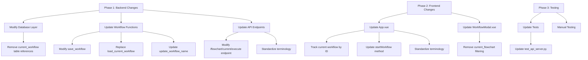

# Refactoring Plan: Removing Current Workflow Concept

## Overview

This document outlines a plan to refactor the application to remove the redundant "current_workflow" concept and consistently use workflow IDs throughout the codebase. Additionally, we'll standardize terminology by using "workflow" consistently instead of mixing "workflow" and "flowchart".

## Current Implementation Issues

1. **Redundant Storage**: Workflows are stored in both the `workflows` table and a separate `current_workflow` table
2. **Synchronization Complexity**: Both copies must be kept in sync
3. **Terminology Inconsistency**: The codebase mixes "workflow" and "flowchart" terms
4. **Potential Concurrency Issues**: The global "current" workflow concept could cause conflicts in multi-user scenarios

## Refactoring Approach



## Detailed Implementation Plan

### Phase 1: Backend Changes

#### 1.1 Modify Database Layer

- **Remove current_workflow table usage**:
  - Keep the `workflows_table` as the single source of truth
  - Remove all references to the `current_workflow` table in the codebase

#### 1.2 Update Workflow Functions in workflows.py

- **Modify `save_workflow()`**:
  ```python
  # Before
  def save_workflow(content: bytes, workflow_id: str = None) -> Tuple[bool, str, str]:
      # ...
      # Also save as current workflow
      current_workflow_table.truncate()  # Clear the current workflow table
      current_workflow_table.insert(flowchart_data)
      # ...
  
  # After
  def save_workflow(content: bytes, workflow_id: str = None) -> Tuple[bool, str, str]:
      # ...
      # Remove the current_workflow_table operations
      # ...
  ```

- **Replace `load_current_workflow()`**:
  ```python
  # Before
  async def load_current_workflow() -> Optional[Dict[str, Any]]:
      # ...
      current_workflow_table = tinydb.db.table("current_workflow")
      current = current_workflow_table.all()
      if current:
          return current[0]
      # ...
  
  # After
  # This function can be removed entirely, as we'll use load_flowchart(workflow_id) instead
  ```

- **Update `update_workflow_name()`**:
  ```python
  # Before
  def update_workflow_name(workflow_id: str, new_name: str) -> Dict[str, Any]:
      # ...
      # If this is the current workflow, update it too
      current_workflow_table = tinydb.db.table("current_workflow")
      current = current_workflow_table.all()
      if current and current[0].get("id") == workflow_id:
          current_workflow_table.update(workflow, tinydb.workflow_query.id == workflow_id)
      # ...
  
  # After
  def update_workflow_name(workflow_id: str, new_name: str) -> Dict[str, Any]:
      # ...
      # Remove the current_workflow_table operations
      # ...
  ```

#### 1.3 Update API Endpoints in api_server.py

- **Modify `/flowchart/current/execute` endpoint**:
  - Deprecate this endpoint and redirect to `/workflows/{id}/execute`
  - Or modify it to require a workflow ID parameter

  ```python
  # Before
  @api.post("/flowchart/current/execute", response_model=WorkflowExecuteResponse)
  async def execute_current_flowchart(request: WorkflowExecuteRequest) -> Dict[str, Any]:
      # ...
      flowchart_data = await load_flowchart("current_flowchart")
      # ...
  
  # After
  @api.post("/workflows/{workflow_id}/execute", response_model=WorkflowExecuteResponse)
  async def execute_workflow(workflow_id: str, request: WorkflowExecuteRequest) -> Dict[str, Any]:
      # ...
      workflow_data = await load_flowchart(workflow_id)
      # ...
  ```

- **Standardize terminology**:
  - Rename `/flowchart` endpoint to `/workflows` for consistency
  - Update function names and variable names to use "workflow" consistently

### Phase 2: Frontend Changes

#### 2.1 Update App.vue

- **Track current workflow by ID**:
  ```javascript
  // Before
  data() {
    return {
      // ...
      currentFlowchartName: null,
      // ...
    }
  }
  
  // After
  data() {
    return {
      // ...
      currentWorkflowId: null,
      currentWorkflowName: null,
      // ...
    }
  }
  ```

- **Update `startWorkflow()` method**:
  ```javascript
  // Before
  startWorkflow() {
    // ...
    axios.post('http://localhost:8000/flowchart/current/execute', {
      input: nodePrompt
    })
    // ...
  }
  
  // After
  startWorkflow() {
    // ...
    axios.post(`http://localhost:8000/workflows/${this.currentWorkflowId}/execute`, {
      input: nodePrompt
    })
    // ...
  }
  ```

- **Standardize terminology**:
  - Rename methods and variables to use "workflow" consistently
  - Update UI text to use "workflow" instead of "flowchart"

#### 2.2 Update WorkflowModal.vue

- **Remove filtering of "current_flowchart.yaml"**:
  ```javascript
  // Before
  const response = await axios.get('http://localhost:8000/workflows');
  this.workflows = response.data.filter(workflow => workflow.filename !== 'current_flowchart.yaml');
  
  // After
  const response = await axios.get('http://localhost:8000/workflows');
  this.workflows = response.data;
  ```

### Phase 3: Testing

#### 3.1 Update test_api_server.py

- **Update mock_workflow fixture**:
  ```python
  # Before
  @pytest.fixture
  def mock_workflow():
      # ...
      current_workflow_table = db.table("current_workflow")
      current_workflow_table.truncate()
      current_workflow_table.insert(test_workflow)
      # ...
  
  # After
  @pytest.fixture
  def mock_workflow():
      # ...
      # Remove current_workflow_table operations
      # ...
  ```

- **Update tests for execute_current_flowchart**:
  - Modify tests to use the `/workflows/{id}/execute` endpoint instead

#### 3.2 Manual Testing

- Test all workflow operations to ensure they work correctly with the new implementation:
  - Creating workflows
  - Saving workflows
  - Loading workflows
  - Executing workflows
  - Updating workflow names
  - Deleting workflows

## Migration Strategy

1. **Database Migration**:
   - Create a script to ensure all workflows in the current_workflow table are properly saved in the workflows table
   - After confirming all data is preserved, remove the current_workflow table

2. **Code Refactoring**:
   - Implement backend changes first
   - Update frontend to work with the new backend
   - Run tests to ensure everything works correctly

3. **Deployment**:
   - Deploy the changes as a single update to minimize disruption
   - Include clear documentation of the changes for developers

## Benefits of This Refactoring

1. **Simplified Data Model**: Single source of truth for workflows
2. **Reduced Complexity**: No need to keep multiple copies in sync
3. **Consistent Terminology**: Using "workflow" consistently throughout the codebase
4. **Improved Maintainability**: Cleaner code that's easier to understand and modify
5. **Better Scalability**: Removal of global state makes the application more suitable for multi-user scenarios